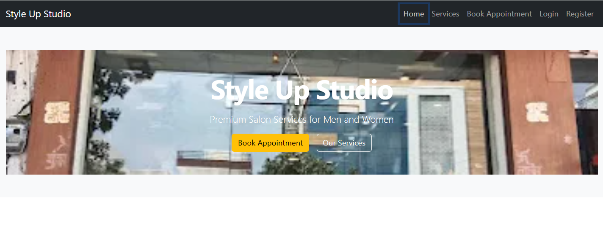
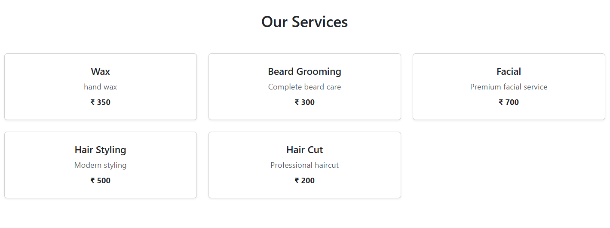
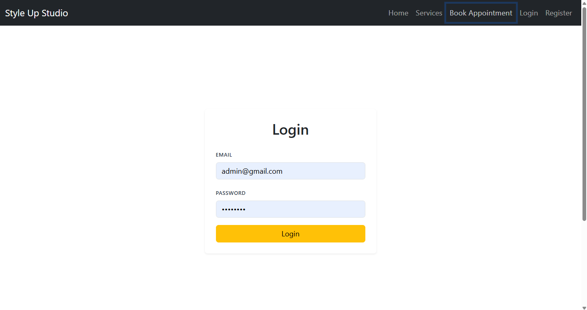
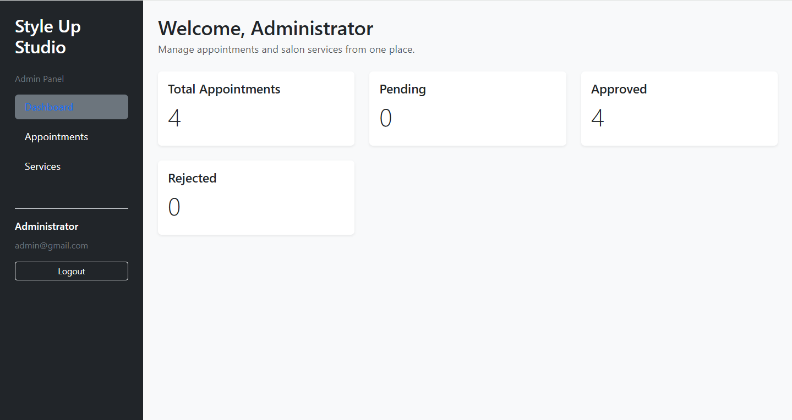
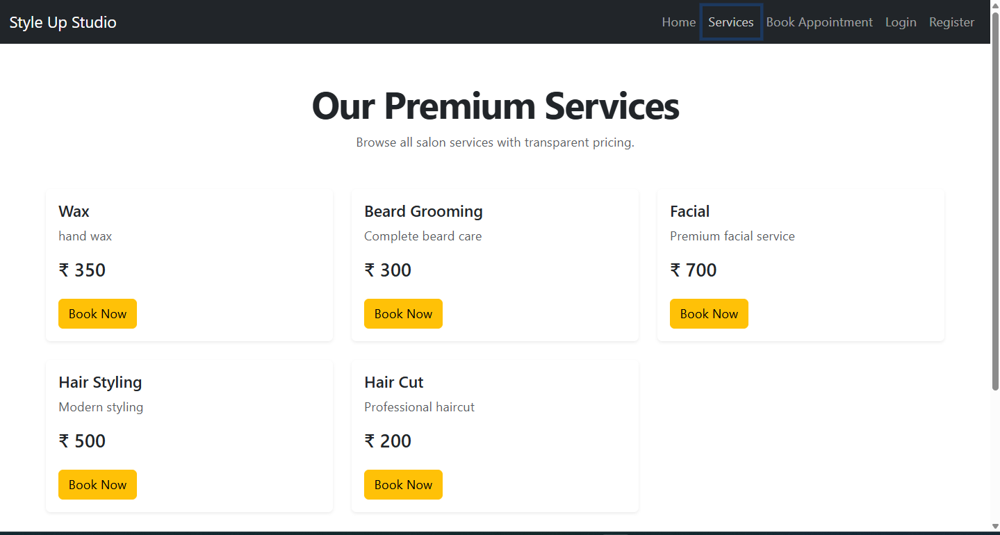
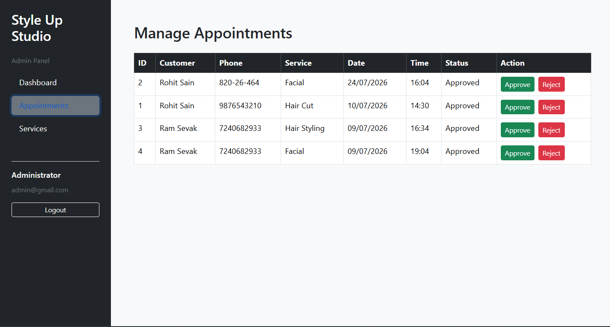

# 💇 Style Up Studio

A **full-stack salon management system** built with **React.js, Node.js, Express.js, and MySQL**.

Style Up Studio is designed to simplify salon operations by allowing customers to browse services, book appointments, and manage their accounts, while providing administrators with a dedicated dashboard to manage services and appointments.

---

# ✨ Features

## 👤 Customer Features

- User Registration & Login
- Browse Salon Services
- View Service Details
- Book Appointments
- Responsive User Interface

## 👨‍💼 Admin Features

- Secure Admin Login
- Admin Dashboard
- Add, Edit & Delete Services
- Manage Customer Appointments
- Update Appointment Status
- Create New Admin Accounts

---

# 🛠️ Tech Stack

## Frontend

- React.js
- Vite
- React Router
- Bootstrap 5
- Axios
- JavaScript

## Backend

- Node.js
- Express.js
- REST APIs
- JWT Authentication
- bcrypt
- dotenv

## Database

- MySQL

---

# 📂 Project Structure

```text
StyleUpStudio
│
├── client
│   ├── src
│   ├── components
│   ├── pages
│   ├── layouts
│   └── api
│
├── server
│   ├── config
│   ├── controllers
│   ├── routes
│   ├── middleware
│   └── server.js
│
├── screenshots
│
├── README.md
└── .gitignore
```

---

# 🔄 Application Workflow

```text
Customer
   │
   ▼
Register / Login
   │
   ▼
Browse Services
   │
   ▼
Book Appointment
   │
   ▼
MySQL Database


Admin
   │
   ▼
Admin Login
   │
   ▼
Dashboard
   │
   ▼
Manage Services
   │
   ▼
Manage Appointments
```

---

# 📸 Screenshots

> **Note:** Place all screenshots inside the `screenshots` folder.

## 🏠 Home Page



---

## 💇 Services Page



---

## 🔐 Login Page



---

## 📅 Appointment Booking


---

## 👨‍💼 Admin Dashboard



---

## 🛠️ Admin Service Management



---

## 📋 Admin Appointment Management



---

# ⚙️ Installation

## Prerequisites

Make sure you have installed:

- Node.js
- npm
- MySQL

---

## Clone the Repository

```bash
git clone https://github.com/rsain4800/StyleUpStudio.git

cd StyleUpStudio
```

---

## Install Frontend

```bash
cd client

npm install

npm run dev
```

Frontend runs at:

```
http://localhost:5173
```

---

## Install Backend

Open another terminal:

```bash
cd server

npm install

npm run dev
```

Backend runs at:

```
http://localhost:5000
```

---

# 🔐 Environment Variables

Create a `.env` file inside the `server` folder.

```env
PORT=5000

DB_HOST=localhost
DB_USER=root
DB_PASSWORD=your_password
DB_NAME=styleup_studio

JWT_SECRET=your_secret_key
```

---

# 🗄️ Database Setup

Create a MySQL database named:

```sql
CREATE DATABASE styleup_studio;
```

Required tables:

- users
- admins
- services
- appointments

---

# 🚀 Future Improvements

- Online Payment Integration
- Image Upload for Services
- Email Notifications
- SMS Notifications
- Appointment Calendar
- Customer Reviews & Ratings
- Dashboard Analytics
- Cloud Deployment
- Automated Testing

---

# 💡 Key Learnings

Through this project, I gained practical experience in:

- Building RESTful APIs using Express.js
- React component-based architecture
- MySQL database design and integration
- Authentication and authorization
- Full-stack application development
- CRUD operations
- Frontend and backend integration using Axios

---

# 👨‍💻 Developer

**Rohit Sain**

B.Tech (Artificial Intelligence & Data Science)

Jaipur Engineering College and Research Centre (JECRC)

GitHub: **https://github.com/rsain4800**

---

# 📄 License

This project is developed for **educational and portfolio purposes**.
