# 💇 Glamora 💗

A **full-stack salon management system** built with **React.js, Node.js, Express.js, and MySQL**.

Glamora is designed to simplify salon operations by allowing customers to create accounts, browse salon services, book appointments, and manage their salon experience, while providing administrators with a dedicated dashboard to manage services and appointments.

---

# ✨ Features

## 👤 Customer Features

- User Registration & Login
- Customer Dashboard
- Browse Salon Services
- View Service Details
- Book Appointments
- Manage Customer Account
- Responsive User Interface
- Customer Logout

## 👑 Admin Features

- Secure Admin Login
- Admin Dashboard
- Add, Edit & Delete Services
- Manage Customer Appointments
- Update Appointment Status
- Create New Admin Accounts
- View Appointment Statistics

---

# 🛠️ Tech Stack

## Frontend

- React.js
- Vite
- React Router
- Bootstrap 5
- Axios
- JavaScript
- CSS

## Backend

- Node.js
- Express.js
- REST APIs
- JWT Authentication
- bcrypt
- dotenv

## Database

- MySQL

---

# 📂 Project Structure

```text
Glamora
│
├── client
│   ├── src
│   ├── components
│   ├── pages
│   ├── layouts
│   └── api
│
├── server
│   ├── config
│   ├── controllers
│   ├── routes
│   ├── middleware
│   └── server.js
│
├── screenshots
│   ├── address.png
│   ├── addservices.png
│   ├── adminDashboard.png
│   ├── allappointments.png
│   ├── bookappointment.png
│   ├── customerDahboard.png
│   ├── gallary.png
│   ├── homepage.png
│   ├── loginpage.png
│   ├── registerpage.png
│   └── servicepage.png
│
├── README.md
└── .gitignore
```

---

# 🔄 Application Workflow

```text
                        💗 Glamora
                             │
              ┌──────────────┴──────────────┐
              │                             │
          👤 Customer                    👑 Admin
              │                             │
              ▼                             ▼
       Register / Login                Admin Login
              │                             │
              ▼                             ▼
       Browse Services               Admin Dashboard
              │                             │
              ▼                     ┌────────┴────────┐
       Book Appointment             │                 │
              │                     ▼                 ▼
              ▼              Manage Services   Manage Appointments
       Customer Dashboard           │                 │
              │                     │                 │
              └─────────────────────┴────────┬────────┘
                                             ▼
                                      🗄️ MySQL Database
```

---

# 📸 Screenshots

> **Note:** All Glamora screenshots are stored inside the `screenshots` folder.

## 🏠 Home Page

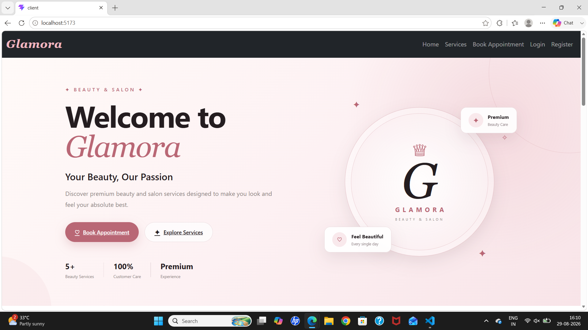

---

## 💇 Services Page

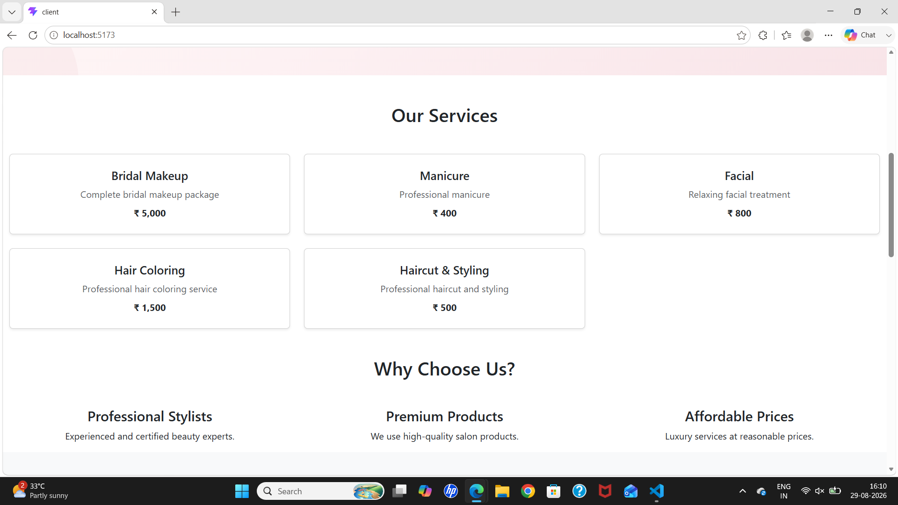

---

## 🔐 Customer Login

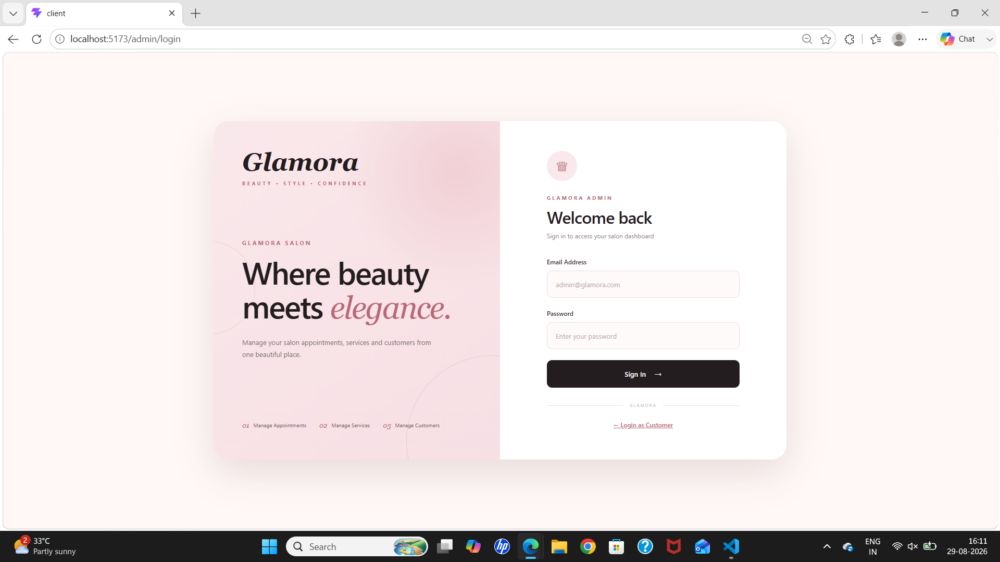

---

## 📝 Customer Registration

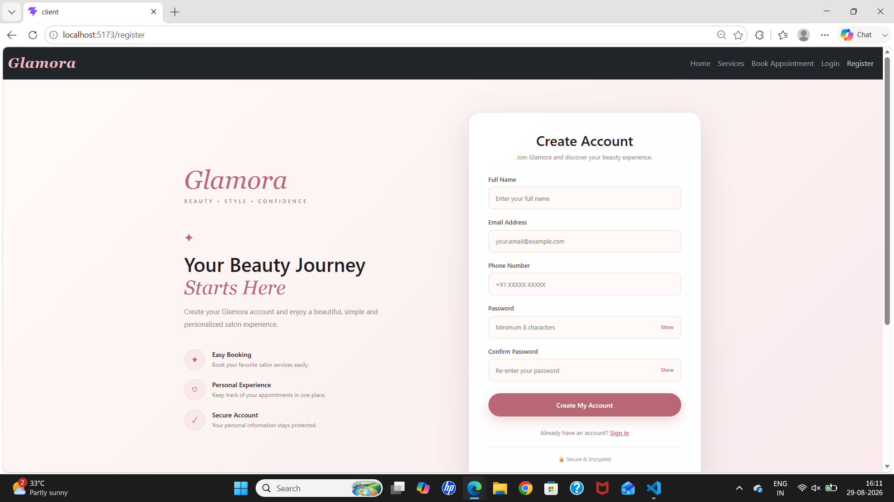

---

## 📅 Book Appointment

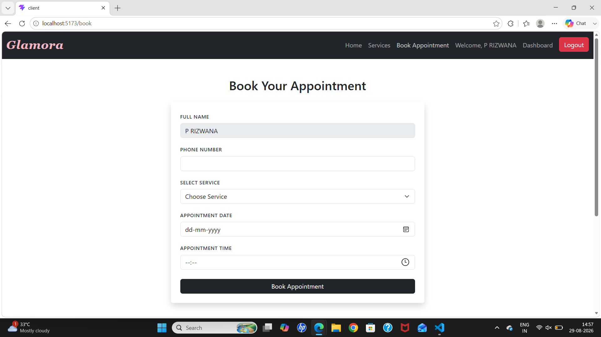

---

## 👤 Customer Dashboard

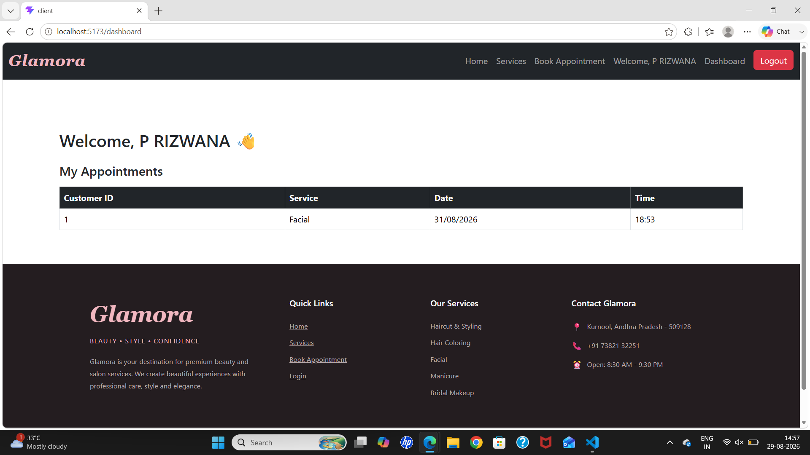

---

## 👑 Admin Dashboard

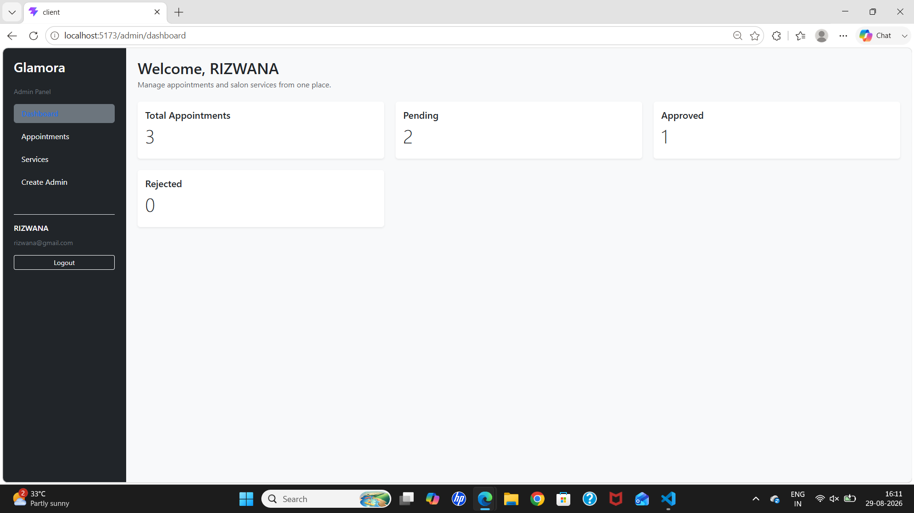

---

## 📋 All Appointments

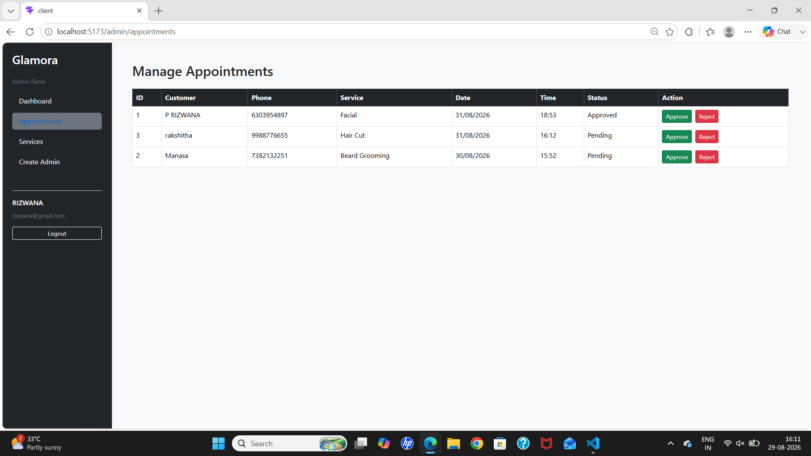

---

## ➕ Add Services

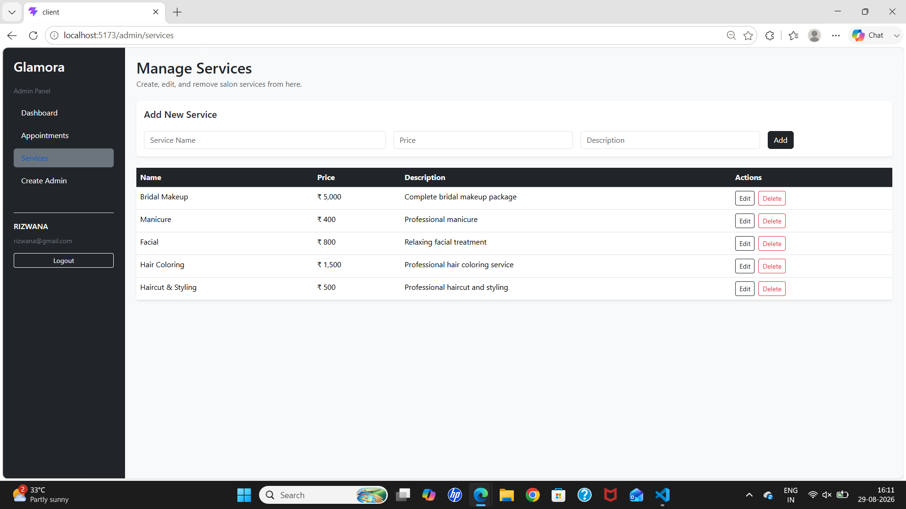

---

## 🖼️ Gallery

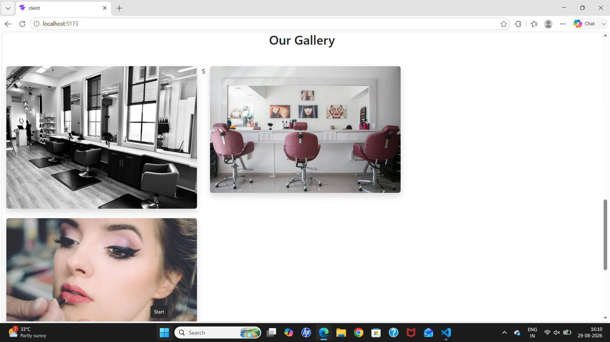

---

## 📍 Salon Address

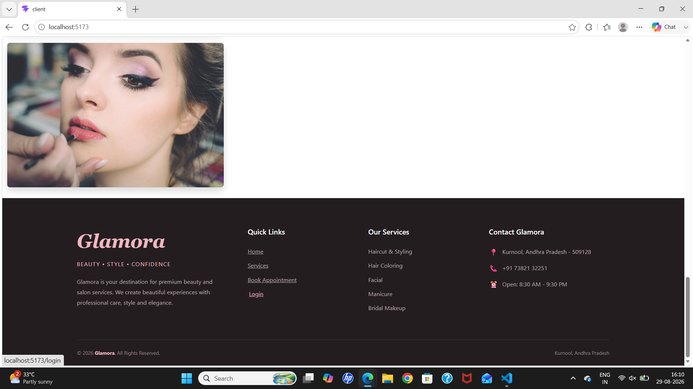

---

# ⚙️ Installation

Follow these steps to run **Glamora** locally on your system.

## 📋 Prerequisites

Make sure you have the following installed:

- Node.js
- npm
- MySQL
- Git
- VS Code

## 📥 Clone Glamora

Clone the Glamora repository from GitHub:

```bash
git clone https://github.com/Rizwana200/Glamora.git
cd Glamora
```

## 🚀 Running the Project

### 1. Setup Backend (Server)

```bash
cd server
npm install
npm start
```

### 2. Setup Frontend (Client)

```bash
cd client
npm install
npm run dev
```

---

# 🚀 Future Improvements

- Online Payment Integration
- Image Upload for Services
- Email Notifications
- SMS Notifications
- Appointment Calendar
- Customer Reviews & Ratings
- Dashboard Analytics
- Cloud Deployment
- Automated Testing

---

# 💡 Key Learnings

Through this project, I gained practical experience in:

- Building RESTful APIs using Express.js
- React component-based architecture
- MySQL database design and integration
- Authentication and authorization
- Full-stack application development
- CRUD operations
- Frontend and backend integration using Axios

---

# 👩‍💻 Developer

## Rizwana 💗

**B.Tech – Computer Science & Engineering**

### GitHub

[https://github.com/Rizwana200](https://github.com/Rizwana200)

---

# 💗 Glamora

**BEAUTY • STYLE • CONFIDENCE**

A full-stack salon management system built to provide a simple, elegant, and personalized beauty experience.

Built with: **React.js • Node.js • Express.js • MySQL**

---

## 🔗 GitHub Repository

[https://github.com/Rizwana200/Glamora.git](https://github.com/Rizwana200/Glamora.git)
